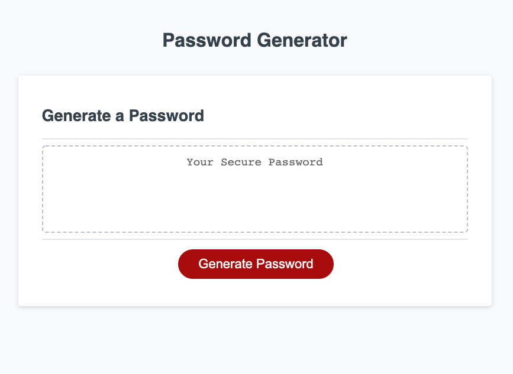

# JavaScript Random Password Generator

## DESCRIPTION
Using Javascript, this page will gather criteria and generate a random password to match criteria given by the user. Designed as a test of beginner Javascript, the techniques I used to acheive a working password generator include the following:  

* Pseudocoding logic to see what needs to happen in js
* Declaring variables and functions
* Utilizing prompts to gather user input and conditional statements to validate the input
* For loop with Math functions to generate random characters from a string that meet the given criteria

This page is viewable at https://bgswilde.github.io/password-generator/

See screenshots below:

## CREDITS
The basic HTML and CSS, along with some starter lines of JavaScript were created by Trilogy Education.
© 2021 Trilogy Education Services, LLC, a 2U, Inc. brand. Confidential and Proprietary. All Rights Reserved. 

## LICENSE
MIT License

Copyright (c) 2021 Brian Wilde

Permission is hereby granted, free of charge, to any person obtaining a copy
of this software and associated documentation files (the "Software"), to deal
in the Software without restriction, including without limitation the rights
to use, copy, modify, merge, publish, distribute, sublicense, and/or sell
copies of the Software, and to permit persons to whom the Software is
furnished to do so, subject to the following conditions:

The above copyright notice and this permission notice shall be included in all
copies or substantial portions of the Software.

THE SOFTWARE IS PROVIDED "AS IS", WITHOUT WARRANTY OF ANY KIND, EXPRESS OR
IMPLIED, INCLUDING BUT NOT LIMITED TO THE WARRANTIES OF MERCHANTABILITY,
FITNESS FOR A PARTICULAR PURPOSE AND NONINFRINGEMENT. IN NO EVENT SHALL THE
AUTHORS OR COPYRIGHT HOLDERS BE LIABLE FOR ANY CLAIM, DAMAGES OR OTHER
LIABILITY, WHETHER IN AN ACTION OF CONTRACT, TORT OR OTHERWISE, ARISING FROM,
OUT OF OR IN CONNECTION WITH THE SOFTWARE OR THE USE OR OTHER DEALINGS IN THE
SOFTWARE.